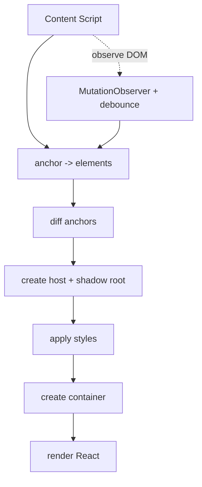
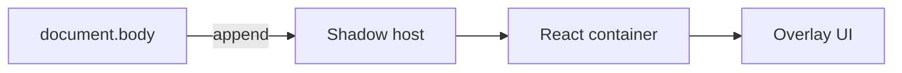
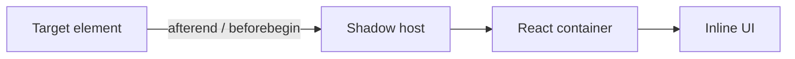

# Easy Extension

<p align="center">
  <a href="https://github.com/wuchuheng/easy-extension-template/stargazers">
    
  </a>
  <a href="https://github.com/wuchuheng/easy-extension-template/issues">
    
  </a>
  <a href="https://github.com/wuchuheng/easy-extension-template/blob/master/LICENSE">
    
  </a>
  <a href="https://github.com/wuchuheng/easy-extension-template/pulls">
    
  </a>
  <a href="https://github.com/wuchuheng/easy-extension-template/commits/master">
    
  </a>
</p>

Chrome extension built with Vite, React, Tailwind, and CRXJS. Content scripts render React UIs inside isolated Shadow DOMs for safe styling, and a generator CLI scaffolds new content scripts with a shared Hello component.

## Why this setup

- **React everywhere**: popup, options, and content scripts share the same React/Tailwind toolchain.
- **Shadow DOM isolation**: content script UIs use `mountAnchoredUI` to keep styles from leaking into or out of the host page.
- **Tailwind utilities**: Tailwind CSS is inlined per content script (`style.css?inline`), no manifest-level CSS needed.
- **CRXJS + Vite**: fast HMR during development, manifest-aware production builds.
- **Scaffold new content scripts quickly**: `npm run gen:content-script <name>` creates a content script folder, a Tailwind stylesheet, registers it in `src/manifest.ts`, and reuses `HelloInCSUI` for an immediate visual check.

## Project layout (key parts)

- `src/manifest.ts` — typed Manifest V3 (via `ManifestV3Export`) pointing to source entries.
- `src/popup`, `src/options` — React/Tailwind UIs.
- `src/contents/default-content` — example content script using `mountAnchoredUI`.
- `src/contents/utils/anchor-mounter.tsx` — reusable helper that:
  - resolves anchors (with debounced mutation observer),
  - creates a Shadow DOM host and injects styles,
  - mounts React via `createRoot`,
  - supports overlay or inline positioning.
- `src/components/HelloInCSUI.tsx` — shared hello widget used by generated scripts.
- `scripts/gen-content-script.ts` — generator that scaffolds content scripts and updates the manifest via the TypeScript compiler API.

## Getting started

```bash
npm install
npm run dev          # CRXJS dev build (watch)
npm run build        # Production build
npm run preview      # Preview build output
npm run lint         # Lint + format (runs type-check too)
npm run type-check   # TypeScript only
```

## Generate a content script

```bash
npm run gen:content-script my-page
```

This creates `src/contents/my-page/index.tsx` and `style.css`, ensures `HelloInCSUI` exists, and adds the entry to `src/manifest.ts`. If the target folder already exists, the command aborts. After running, `.tmp` (used for tsx IPC) is cleaned automatically when set by the npm script.

## Content script pattern

- Import `mountAnchoredUI`, your component, and `style.css?inline`.
- Anchors: `anchor` callback returns one or more elements. An overlay anchor is typically `document.body`; inline anchors are specific elements. The helper debounces DOM mutations and only mounts new anchors (to avoid loops when inserted inline).
- Mount types:
  - **Overlay**: append to `document.body` with high z-index.
  - **Inline**: insert next to a specific element (`beforebegin`, `afterbegin`, `beforeend`, `afterend`).
- Styles are applied inside the Shadow DOM, keeping host page CSS separate.

### Anchor lifecycle (Mermaid)



### Overlay vs Inline (Mermaid)

Overlay:



Inline:



### Anchor examples

Overlay (body):

```tsx
import HelloInCSUI from '@/components/HelloInCSUI';
import styles from './style.css?inline';
import { mountAnchoredUI } from '../utils/anchor-mounter';

void mountAnchoredUI({
  anchor: async () => [document.body],
  mountType: { type: 'overlay' },
  component: () => <HelloInCSUI name="overlay-demo" />,
  style: styles,
  hostId: 'extension-content-root',
});
```

Inline (next to specific elements):

```tsx
void mountAnchoredUI({
  anchor: async () => document.querySelectorAll('.product-card'),
  mountType: { type: 'inline', position: 'afterend' },
  component: () => <HelloInCSUI name="inline-demo" />,
  style: styles,
  hostId: 'extension-inline-root',
});
```

Inline (first child inside target):

```tsx
void mountAnchoredUI({
  anchor: async () => document.querySelectorAll('#pricing'),
  mountType: { type: 'inline', position: 'afterbegin' },
  component: () => <HelloInCSUI name="inline-inside" />,
  style: styles,
});
```

Notes:

- The helper debounces DOM mutations (500ms default) and only mounts new anchors. It ignores previously mounted hosts to avoid self-trigger loops when inserting inline.
- Keep host/container IDs unique per script if running multiple content scripts on the same page. Use `hostId` to avoid collisions.

Example (overlay on body):

```tsx
import HelloInCSUI from '@/components/HelloInCSUI';
import styles from './style.css?inline';
import { mountAnchoredUI } from '../utils/anchor-mounter';

void mountAnchoredUI({
  anchor: async () => [document.body],
  mountType: { type: 'overlay' },
  component: () => <HelloInCSUI name="hello-world" />,
  style: styles,
  hostId: 'extension-content-root',
});
```

## Aliases and tooling

- Path alias `@/*` -> `src/*` (configured in `tsconfig.json` and `vite.config.ts`).
- TypeScript includes `chrome` types for manifest and extension APIs.
- Tailwind scans `src/contents/**/*`, `src/popup/**/*`, `src/options/**/*`.

## Notes and known items

- Lint warnings in `src/shared/storage.ts` about `any` remain (pre-existing); functionality is unaffected.
- If you see temp directory leftovers, the generator cleans `.tmp` when used via the npm script; otherwise remove manually.
