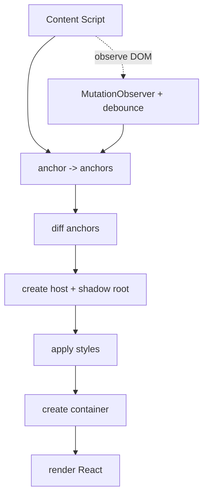

# React + Tailwind Content Script (Isolated UI)

## Goals

- Render content-script UI with React while keeping Tailwind utilities available.
- Isolate styles from the host page via Shadow DOM (no leakage either way).
- Support multiple anchors (overlay or inline) with a single, reusable mount helper.
- Keep API surface small and readable (anchor getter + mount type + component + style).

## Core Approach

- Use one helper `mountAnchoredUI` that orchestrates: anchor resolution, DOM observation (debounced), diffing anchors, Shadow DOM host creation, style injection, and React render.
- Tailwind CSS is imported as text (`style.css?inline`) and applied inside the Shadow DOM (constructable stylesheet with `<style>` fallback).
- No manifest-level CSS for content scripts; styles live inside each shadow root.

## API: `mountAnchoredUI`

```ts
type InlinePosition = 'beforebegin' | 'afterbegin' | 'beforeend' | 'afterend'; // insertAdjacentElement positions

type MountType = { type: 'overlay' } | { type: 'inline'; position?: InlinePosition }; // default 'afterend'

interface MountAnchoredUIArgs {
  anchor: () => Promise<Element[] | NodeListOf<Element> | undefined>; // run once + on DOM changes
  mountType: MountType;
  component: () => React.ReactElement; // factory for the React tree
  style: string; // inline CSS text (e.g., import styles from './style.css?inline')
  hostId?: string; // optional; auto-generated if omitted
  debounceMs?: number; // optional; default 500ms for mutation observer debounce
}
```

## Behavior

1. Initial anchors: call `anchor()` once; if empty/undefined, do nothing.
2. Observe DOM: attach `MutationObserver` (childList + subtree). On changes, debounce (500ms default), then rerun `anchor()`.
3. Diff anchors: compare new anchors vs cached; for any new anchor, create a mount; ignore unchanged ones.
4. For each new anchor:
   - Create host with `hostId` (or generated) and attach open shadow root.
   - Inject styles into shadow root (constructable stylesheet if supported, else `<style>` tag).
   - Create a mount container inside the shadow root.
   - Place host:
     - Overlay: append to `document.body` (positioning handled via CSS for overlay semantics).
     - Inline: insert relative to anchor via `insertAdjacentElement` using `position` (default `afterend`).
   - Render `component()` into the container via `createRoot`.
5. Cache mounted anchors to prevent duplicates. (Cleanup on anchor removal can be added later if needed.)

## Styling Notes

- Tailwind directives live in `style.css`: `@tailwind base; @tailwind components; @tailwind utilities;`
- Optional reset in the same file (e.g., `:host { all: initial; font-family: ... }`) applies inside the shadow root only.

## Lifecycle (Mermaid)



## Usage Examples (conceptual)

### Overlay (body-level)

```ts
import styles from './style.css?inline'
import App from './App'
import { mountAnchoredUI } from '../utils/anchor-mounter'

mountAnchoredUI({
  anchor: async () => [document.body],
  mountType: { type: 'overlay' },
  component: () => <App />,
  style: styles,
  hostId: 'extension-overlay-root' // optional
})
```

### Inline (next to targets)

```ts
import styles from './style.css?inline'
import App from './App'
import { mountAnchoredUI } from '../utils/anchor-mounter'

mountAnchoredUI({
  anchor: async () => document.querySelectorAll('#pricing'),
  mountType: { type: 'inline', position: 'afterend' },
  component: () => <App />,
  style: styles,
  hostId: 'pricing-inline-root' // optional
})
```

## Validation

- `npm run build` should succeed (CSS inlined into content script chunks).
- Manual QA: load unpacked extension, open a page, verify UI renders with Tailwind and remains isolated from host styles.
- Isolation check: confirm Tailwind classes don’t appear in the main document; styles exist only inside shadow roots.
